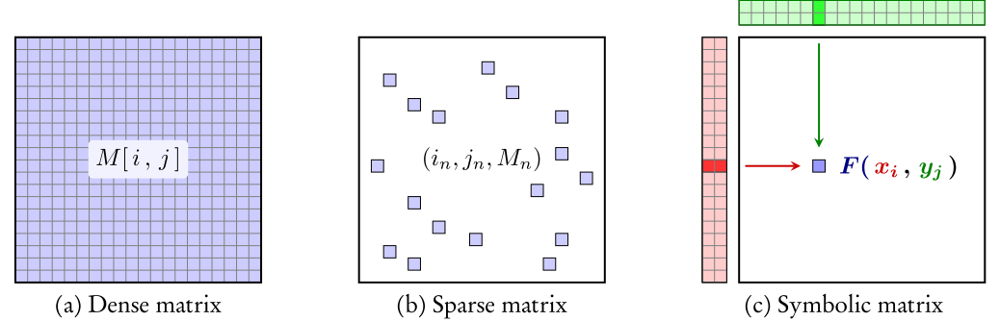

.. _user_guide:

.. currentmodule:: torchdr

.. automodule:: torchdr
   :no-members:
   :no-inherited-members:

User Guide
==========

.. contents:: Table of Contents
   :depth: 1
   :local:

Overview
--------

General Formulation of Dimensionality Reduction
^^^^^^^^^^^^^^^^^^^^^^^^^^^^^^^^^^^^^^^^^^^^^^^^

DR aims to construct a low-dimensional representation (or embedding) :math:`\mathbf{Z} = (\mathbf{z}_1, ..., \mathbf{z}_n)^\top` of an input dataset :math:`\mathbf{X} = (\mathbf{x}_1, ..., \mathbf{x}_n)^\top` that best preserves its geometry, encoded via a pairwise affinity matrix :math:`\mathbf{P}`. To this end, DR methods optimize :math:`\mathbf{Z}` such that a pairwise affinity matrix in the embedding space (denoted :math:`\mathbf{Q}`) matches :math:`\mathbf{P}`. This general problem is as follows

.. math::

  \min_{\mathbf{Z}} \: \mathcal{L}( \mathbf{P}, \mathbf{Q}) \quad \text{(DR)}

where :math:`\mathcal{L}` is typically the :math:`\ell_2` or cross-entropy loss.

TorchDR is structured around the above formulation :math:`\text{(DR)}`.
The input affinity :math:`\mathbf{P}` is constructed using an :class:`Affinity <Affinity>` object.
For the embedding affinity :math:`\mathbf{Q}`, TorchDR offers flexibility: it can be defined as a separate :class:`Affinity <Affinity>` object or, more commonly, the embedding kernel is integrated directly into the loss function for efficiency.

All modules follow the ``sklearn`` :cite:`pedregosa2011scikit` API and can be used in `sklearn pipelines <https://scikit-learn.org/stable/modules/generated/sklearn.pipeline.Pipeline.html>`_.

GPU Support
^^^^^^^^^^^

TorchDR is built on top of ``torch`` :cite:`paszke2019pytorch`, offering GPU support and automatic differentiation. To utilize GPU support, set :attr:`device="cuda"` when initializing any module; for CPU computations, set :attr:`device="cpu"`. DR particularly benefits from GPU acceleration as most computations involve matrix reductions that are highly parallelizable.

The following sections cover the available DR methods, the affinity building blocks, and advanced scalability options.

Dimensionality Reduction Methods
--------------------------------

TorchDR provides a wide range of dimensionality reduction (DR) methods. All DR estimators inherit the structure of the :meth:`DRModule` class:

.. autosummary::
   :toctree: stubs
   :template: myclass_template.rst
   :nosignatures:

   torchdr.DRModule

They are :class:`sklearn.base.BaseEstimator` and :class:`sklearn.base.TransformerMixin` classes which can be called with the ``fit_transform`` method.

Outside of :ref:`spectral-section`, a closed-form solution to the DR problem is typically not available. The problem can then be solved using `gradient-based optimizers <https://pytorch.org/docs/stable/optim.html>`_.

For users who want full control over both input and output affinities, the :class:`AffinityMatcher <AffinityMatcher>` class provides a flexible base that accepts separate :attr:`affinity_in` and :attr:`affinity_out` objects.

.. autosummary::
   :toctree: stubs
   :template: myclass_template.rst
   :nosignatures:

   torchdr.AffinityMatcher

In what follows we briefly present two families of DR algorithms: neighbor embedding methods and spectral methods.

.. _neighbor-embedding-section:

Neighbor Embedding
^^^^^^^^^^^^^^^^^^^

TorchDR aims to implement most popular **neighbor embedding (NE)** algorithms.
In these methods, :math:`\mathbf{P}` and :math:`\mathbf{Q}` can be viewed as **soft neighborhood graphs**, hence the term *neighbor embedding*.

NE objectives share a common structure: they minimize a weighted sum of an attractive term and a repulsive term. The attractive term is often the cross-entropy between the input and output affinities, while the repulsive term is typically a function of the output affinities only. Thus, the NE problem can be formulated as:

.. math::

    \min_{\mathbf{Z}} \: - \lambda \sum_{ij} P_{ij} \log Q_{ij} + \mathcal{L}_{\mathrm{rep}}(\mathbf{Q}) \:.

In the above, :math:`\mathcal{L}_{\mathrm{rep}}(\mathbf{Q})` represents the repulsive part of the loss function while :math:`\lambda` is a hyperparameter that controls the balance between attraction and repulsion. The latter is called :attr:`early_exaggeration_coeff` in TorchDR because it is often set to a value larger than one at the beginning of the optimization.

Many NE methods can be represented within this framework. See below for some examples.

.. list-table::
   :widths: auto
   :header-rows: 1

   * - **Method**
     - **Repulsive term** :math:`\mathcal{L}_{\mathrm{rep}}`
     - **Input affinity** :math:`\mathbf{P}`
     - **Embedding kernel** :math:`\mathbf{Q}`

   * - :class:`SNE <SNE>`
     - :math:`\sum_{i} \log(\sum_j Q_{ij})`
     - :class:`EntropicAffinity <EntropicAffinity>`
     - :math:`Q_{ij} = \exp(- \| \mathbf{z}_i - \mathbf{z}_j \|^2)`

   * - :class:`TSNE <TSNE>`
     - :math:`\log(\sum_{ij} Q_{ij})`
     - :class:`EntropicAffinity <EntropicAffinity>`
     - :math:`Q_{ij} = (1 + \| \mathbf{z}_i - \mathbf{z}_j \|^2)^{-1}`

   * - :class:`TSNEkhorn <TSNEkhorn>`
     - :math:`\sum_{ij} Q_{ij}`
     - :class:`SymmetricEntropicAffinity <SymmetricEntropicAffinity>`
     - :class:`SinkhornAffinity(base_kernel="student") <SinkhornAffinity>`

   * - :class:`InfoTSNE <InfoTSNE>`
     - :math:`\sum_i \log(\sum_{j \in \mathrm{Neg}(i)} Q_{ij})`
     - :class:`EntropicAffinity <EntropicAffinity>`
     - :math:`Q_{ij} = (1 + \| \mathbf{z}_i - \mathbf{z}_j \|^2)^{-1}`

   * - :class:`UMAP <UMAP>`
     - :math:`- \sum_{i, j \in \mathrm{Neg}(i)} \log (1 - Q_{ij})`
     - :class:`UMAPAffinity <UMAPAffinity>`
     - :math:`Q_{ij} = (1 + a \| \mathbf{z}_i - \mathbf{z}_j \|^{2b})^{-1}`

   * - :class:`LargeVis <LargeVis>`
     - :math:`- \sum_{i, j \in \mathrm{Neg}(i)} \log (1 - Q_{ij})`
     - :class:`EntropicAffinity <EntropicAffinity>`
     - :math:`Q_{ij} = (1 + \| \mathbf{z}_i - \mathbf{z}_j \|^2)^{-1}`

In the above table, :math:`\mathrm{Neg}(i)` denotes the set of negative samples
for point :math:`i`. They are usually sampled uniformly at random from the dataset.

.. _spectral-section:

Spectral Methods
^^^^^^^^^^^^^^^^

Spectral methods correspond to choosing the scalar product affinity :math:`P_{ij} = \langle \mathbf{z}_i, \mathbf{z}_j \rangle` for the embeddings and the :math:`\ell_2` loss.

.. math::

    \min_{\mathbf{Z}} \: \sum_{ij} ( P_{ij} - \langle \mathbf{z}_i, \mathbf{z}_j \rangle )^{2}

When :math:`\mathbf{P}` is positive semi-definite, this problem is commonly known as kernel Principal Component Analysis :cite:`ham2004kernel` and an optimal solution is given by

.. math::

    \mathbf{Z}^{\star} = (\sqrt{\lambda_1} \mathbf{v}_1, ..., \sqrt{\lambda_d} \mathbf{v}_d)^\top

where :math:`\lambda_1, ..., \lambda_d` are the largest eigenvalues of the centered kernel matrix :math:`\mathbf{P}` and :math:`\mathbf{v}_1, ..., \mathbf{v}_d` are the corresponding eigenvectors.

.. note::

    PCA (available at :class:`torchdr.PCA`) corresponds to choosing :math:`P_{ij} = \langle \mathbf{x}_i, \mathbf{x}_j \rangle`.

Affinities
----------

Affinities are the essential building blocks of dimensionality reduction methods.
TorchDR provides a wide range of affinities. See :ref:`api_and_modules` for a complete list.

Base structure
^^^^^^^^^^^^^^

Affinities inherit the structure of the following :meth:`Affinity` class.

.. autosummary::
   :toctree: stubs
   :template: myclass_template.rst
   :nosignatures:

   torchdr.Affinity

If computations can be performed in log domain, the :meth:`LogAffinity` class should be used.

.. autosummary::
   :toctree: stubs
   :template: myclass_template.rst
   :nosignatures:

   torchdr.LogAffinity

Affinities are objects that can directly be called. The outputted affinity matrix is a **square matrix of size (n, n)** where n is the number of input samples.

Here is an example with the :class:`NormalizedGaussianAffinity <torchdr.NormalizedGaussianAffinity>`:

    >>> import torch, torchdr
    >>>
    >>> n = 100
    >>> data = torch.randn(n, 2)
    >>> affinity = torchdr.NormalizedGaussianAffinity(normalization_dim=None)
    >>> affinity_matrix = affinity(data)
    >>> print(affinity_matrix.shape)
    (100, 100)

Spotlight on affinities based on entropic projections
^^^^^^^^^^^^^^^^^^^^^^^^^^^^^^^^^^^^^^^^^^^^^^^^^^^^^^

A widely used family of affinities focuses on **controlling the entropy** of the affinity matrix. It is notably a crucial component of Neighbor-Embedding methods (see :ref:`neighbor-embedding-section`).

These affinities are normalized such that each row sums to one, allowing the affinity matrix to be viewed as a **Markov transition matrix**. An adaptive bandwidth parameter then determines how the mass from each point spreads to its neighbors. The bandwidth is based on the :attr:`perplexity` hyperparameter which controls the number of effective neighbors for each point.

The resulting affinities can be viewed as a soft approximation of a k-nearest neighbor graph, where :attr:`perplexity` takes the role of k. This allows for capturing more nuances than binary weights, as closer neighbors receive a higher weight compared to those farther away. Ultimately, :attr:`perplexity` is an interpretable hyperparameter that governs the scale of dependencies represented in the affinity.

The following table outlines the aspects controlled by different formulations of entropic affinities. **Marginal** indicates whether each row of the affinity matrix has a controlled sum. **Symmetry** indicates whether the affinity matrix is symmetric. **Entropy** indicates whether each row of the affinity matrix has controlled entropy, dictated by the :attr:`perplexity` hyperparameter.

.. list-table::
   :widths: auto
   :header-rows: 1

   * - **Affinity (associated DR method)**
     - **Marginal**
     - **Symmetry**
     - **Entropy**
   * - :class:`NormalizedGaussianAffinity <NormalizedGaussianAffinity>`
     - ✅
     - ❌
     - ❌
   * - :class:`SinkhornAffinity <SinkhornAffinity>`
     - ✅
     - ✅
     - ❌
   * - :class:`EntropicAffinity <EntropicAffinity>`
     - ✅
     - ❌
     - ✅
   * - :class:`SymmetricEntropicAffinity <SymmetricEntropicAffinity>`
     - ✅
     - ✅
     - ✅

More details on these affinities can be found in the `SNEkhorn paper <https://proceedings.neurips.cc/paper_files/paper/2023/file/8b54ecd9823fff6d37e61ece8f87e534-Paper-Conference.pdf>`_ :cite:`van2024snekhorn`.

.. minigallery:: torchdr.EntropicAffinity
    :add-heading: Examples using ``EntropicAffinity``:

Other various affinities
^^^^^^^^^^^^^^^^^^^^^^^^

TorchDR features other affinities that can be used in various contexts.

For instance, the UMAP :cite:`mcinnes2018umap` algorithm relies on the affinity :class:`UMAPAffinity <torchdr.UMAPAffinity>` in input space.
:class:`UMAPAffinity <torchdr.UMAPAffinity>` follows a similar construction as entropic affinities to ensure a constant number of effective neighbors, with :attr:`n_neighbors` playing the role of the :attr:`perplexity` hyperparameter.

Another example is the doubly stochastic normalization of a base affinity under the :math:`\ell_2` geometry that has recently been proposed for DR :cite:`zhang2023manifold`. This method is analogous to :class:`SinkhornAffinity <torchdr.SinkhornAffinity>` where the Shannon entropy is replaced by the :math:`\ell_2` norm to recover a sparse affinity.
It is available at :class:`DoublyStochasticQuadraticAffinity <torchdr.DoublyStochasticQuadraticAffinity>`.

Scalability & Backends
----------------------

For large datasets, TorchDR provides several options to scale computations.

Handling the quadratic cost via sparsity or symbolic tensors
^^^^^^^^^^^^^^^^^^^^^^^^^^^^^^^^^^^^^^^^^^^^^^^^^^^^^^^^^^^^^

Affinities naturally incur a quadratic memory cost, which can be particularly
problematic when dealing with large numbers of samples, especially when using GPUs.

Many affinity metrics only require computing distances to each point's k nearest neighbors.
For large datasets (typically when :math:`n > 10^4`) where the full pairwise-distance matrix won't fit in GPU memory,
TorchDR can offload these computations to the GPU-compatible kNN library `Faiss <https://github.com/facebookresearch/faiss>`_.
Simply set :attr:`backend` to ``faiss`` to leverage Faiss's efficient implementations.

Alternatively, for exact computations or affinities that can't be limited to kNNs, you can use symbolic (lazy) tensors to avoid memory overflows.
TorchDR integrates with ``pykeops``:cite:`charlier2021kernel`, representing tensors as mathematical expressions evaluated directly on your data samples.
By computing on-the-fly formulas instead of storing full matrices, this approach removes memory constraints entirely.
However, for very large datasets (typically when :math:`n > 10^5`), the computational cost becomes prohibitive.
Simply set :attr:`backend` to ``keops`` in any module to enable it.

The above figure is taken from `here <https://github.com/getkeops/keops/blob/main/doc/_static/symbolic_matrix.svg>`_.

Multi-GPU distributed training
^^^^^^^^^^^^^^^^^^^^^^^^^^^^^^

For very large datasets, TorchDR supports **multi-GPU distributed training** to parallelize computations across multiple GPUs. This is particularly useful when the affinity matrix is too large to compute on a single GPU or when faster computation is needed.

**How it works:**

1. **Data partitioning**: The full dataset :math:`\mathbf{X} \in \mathbb{R}^{N \times d}` is split into chunks across GPUs. Each GPU handles a subset of :math:`n_i` samples.

2. **Shared neighbor index**: A FAISS index is built on the full dataset and shared across all GPUs, enabling efficient k-nearest neighbor queries.

3. **Parallel affinity computation**: Each GPU computes the affinity rows for its chunk by querying the shared index. GPU :math:`i` computes rows :math:`[\text{start}_i, \text{end}_i)` of the affinity matrix.

4. **Distributed gradient computation**: During optimization, each GPU:

   - Computes gradients :math:`\nabla \mathcal{L}_i` for its local chunk
   - Maintains a full copy of the embedding :math:`\mathbf{Z} \in \mathbb{R}^{N \times q}`
   - Synchronizes gradients via **all-reduce** across GPUs

5. **Synchronized updates**: After all-reduce, each GPU has identical aggregated gradients and applies the same optimizer step, keeping embeddings synchronized.

.. image:: figures/multi_gpu_dr_extended.png
   :width: 800
   :align: center

*Multi-GPU dimensionality reduction pipeline. The dataset is split into chunks across GPUs. Each GPU performs neighbor search using a shared index, computes its affinity chunk, and generates local gradients. Gradients are synchronized via all-reduce and used to update the embedding copies maintained on each device.*

**Usage:**

Multi-GPU mode is enabled automatically when launching with ``torchrun`` or the TorchDR CLI:

.. code-block:: bash

    # Using the TorchDR CLI (recommended)
    torchdr --gpus 4 your_script.py

    # Or using torchrun directly
    torchrun --nproc_per_node=4 your_script.py

In your script, simply use TorchDR as usual:

.. code-block:: python

    import torchdr

    # Distributed mode is auto-detected when launched with torchrun
    model = torchdr.UMAP(n_neighbors=15, verbose=True)
    embedding = model.fit_transform(X)

**Requirements:**

- ``backend="faiss"`` (default for most methods)
- Multiple CUDA GPUs available
- Launch with ``torchdr`` CLI or ``torchrun``

**Supported methods:**

Currently, the following methods support multi-GPU:

- :class:`UMAP <UMAP>`
- :class:`InfoTSNE <InfoTSNE>`
- :class:`LargeVis <LargeVis>`

DataLoader for Streaming Data
^^^^^^^^^^^^^^^^^^^^^^^^^^^^^

For datasets too large to fit in RAM, TorchDR supports passing a PyTorch ``DataLoader`` directly to ``fit_transform`` instead of a tensor. This enables streaming computation where data is processed batch-by-batch.

**How it works:**

1. **Incremental index building**: The FAISS index is built incrementally from batches
2. **Batch-by-batch k-NN queries**: Neighbor queries are performed as each batch arrives
3. **Automatic PCA initialization**: When ``init="pca"``, :class:`IncrementalPCA <IncrementalPCA>` is used automatically

**Usage:**

.. code-block:: python

    from torch.utils.data import DataLoader, TensorDataset
    import torchdr

    dataset = TensorDataset(X)  # X is your large tensor
    dataloader = DataLoader(dataset, batch_size=10000)

    model = torchdr.UMAP(n_neighbors=15, backend="faiss")
    embedding = model.fit_transform(dataloader)

**Requirements:**

- ``backend="faiss"`` must be used
- The DataLoader must yield tensors (or tuples where the first element is the data tensor)
